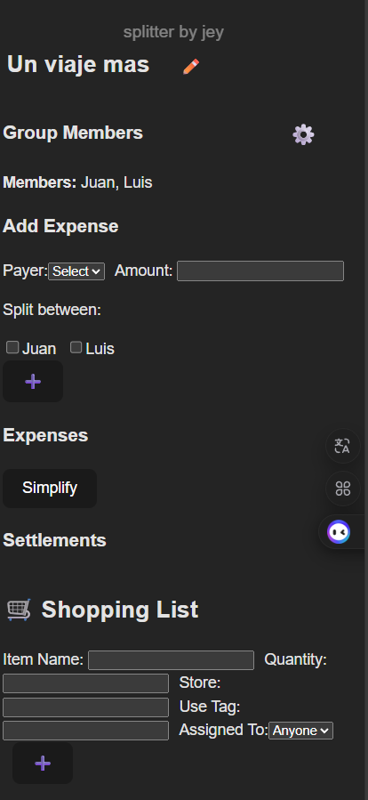
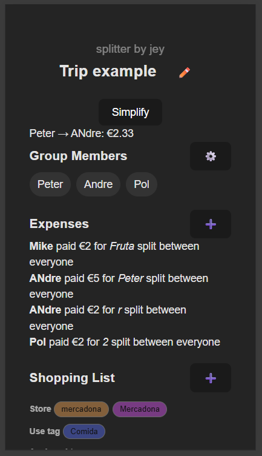
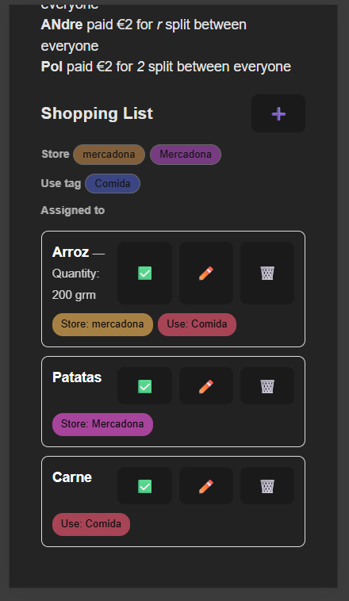
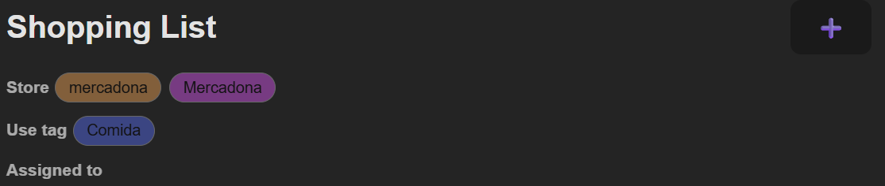

Pendientes:
    Incluir react icons? Si, en especial para la navabar                                                                                                                                                                                                                                                                                                                                                        
    Deberia usar el boton Simplify o solo esconder los settlements?
    
    
     
    Incluir imagen Your Cart is Empty, Add items to get started boton agregar
    Color de la etiqueta dle filtro no coincide con color de la etiqueta en el item.
    Hacer que tags y store siempre se cpaitalicen apra evitar duplicados
    Incluir edicion rapida de varios items (marcar comprado, cambiar el sotre a la vez, cambiar el tag a la vez)

Splitter by Jey

Una app de división de gastos y lista de compras grupal, pensada para reuniones, viajes y actividades compartidas. Diseñada desde cero con React + Vite y enfoque mobile-first.

🔍 Propósito

Quería una alternativa a Splitwise o Tricount, pero con:

Una interfaz más limpia y directa
Menos fricción para agregar personas y gastos
Integración natural de la lista de la compra, no como funcionalidad secundaria
Lógica centrada en los momentos reales de uso: planificación, compras, y cierre de cuentas

✅ Características actuales

Personalización del nombre del viaje/actividad
Agregado de miembros del grupo (sin login)
Registro de gastos con división entre participantes
Sistema de simplificación de cuentas (algoritmo de balanceo de deudas)
Lista de la compra con tarjetas interactivas (editar, borrar, marcar como comprado)
Filtros por tienda, uso, asignado a persona y estado (comprado/sin comprar)
Interfaz responsive, optimizada para móvil

⚙ Tecnologías usadas

React puro (sin framework externo)
Vite (por su velocidad y simplicidad para proyectos React)
Componentes modulares
Sin librerías de UI: todo el diseño se hizo a mano

⚖️ Decisiones clave

1. De tabla a tarjetas en Shopping List

Inicialmente, quise una tabla para poder filtrar desde el encabezado. Pero:
Mal rendimiento en móvil
Layouts forzados
Scroll horizontal
Migré a un diseño de tarjetas:
Cada item con cantidad visible
Etiquetas con store, uso, y asignado
Interacción más rápida
Filtros arriba del listado, como botones

2. Centralización de estados

Para evitar props innecesarias y mantener la lógica bajo control:
Main gestiona todos los estados globales
Los popups solo reciben handlers
Esto permite coordinar visibilidad, edición y flujo sin complejidad innecesaria

3. Menú inferior

Probé con botones individuales en cada sección, pero ocupaban mucho espacio. Ahora:
Planeo mover acciones globales (como "simplify" o "edit group") a un menú inferior persistente
Cada sección se podrá colapsar/expandir para enfocar la atención

4. Shopping list expandible

Incialmente los items se acomulaban en al seccion SHoppin List, haciendo que el usario tuvera que hacer scroll para verlos. Scroll infinito
4.1. FIltros del shopping list.
 Deberia mostrar algunos filtros? No, ocupa demasiado espacio vertical, cambiado a botones
Los filtors se pueden combinar
Edicion rapida de varias items

🪤 Lógica destacada

Simplificación de cuentas
Se implementó un algoritmo que:

Calcula el balance individual
Agrupa deudores y acreedores
Genera el número mínimo de transferencias para saldar cuentas
Colores de etiquetas
Cada etiqueta (tienda, uso, asignado a) recibe un color aleatorio, pero consistente:
Se almacena en un diccionario en memoria
Si una etiqueta ya existe, se reusa el color
Popups modulares reutilizables

Se creó un componente PopupWrapper:

Estandariza estilo, centrado y fondo oscuro
Utilizado para: agregar gastos, items, miembros, etc.
Permite futuros usos como whiteboard o exportaciones

🤯 Aprendizajes

El layout importa tanto como la funcionalidad. Una tabla técnicamente correcta no es lo mejor para un dedo.
Tener los estados globales en el componente principal permite un control total y evita bugs de sincronización.
Reutilizar patrones como popups y tarjetas acelera el desarrollo sin comprometer flexibilidad.

🌐 Futuro del proyecto

🚀 Deploy

Repositorio: github.com/tuusuario/splitter-by-jey
Deploy: https://jeysplit.netlify.app/

📅 Desarrollado en 2025 por Jey. Diseño, lógica y desarrollo desde cero.

FASE 1
ExpensePage.
-Renderizamos ExpensesList en ExpensePage (igual que ShoppinList dentro de ShoppingPage)
-Agregamos boton "simplificar" (el mismo de Main)
-Añadimos un botón "exportar cuentas" (por desarrollar, no lo haremos ahora)
-Hacemos que todos los botones del NavMenu funcionen correctamente (como en la pagina Main y ShoppingPage)
- Hacemos que tods los PopUp funcionen correctamente.

FASE 2
1.Para el NavMenu mostaremos al usuario (de manera sutil) en que pagina estamos
2.Para el NavMenu damos protagonismo leve al elmento principal "add"
3.Cambiamos el botón compartir en el NavMenu por un botón desplegable (se desplegará en bottom right) y mostrará las opciones: Manage Group Members, Change title, Share this trip, donate to creator.
4.Usamos react icons para hacer todo mas minimalista y funcional, usaremos iconos de contrno para el NavMenu y rellenos cuando el usuario esté en la página o haga una acción. incluiremos animaciones elegantes minimalistas.

FASE 3
Cambiar todos los iconos por iconos react, siempre con enfoque sleek, elegant, minimalist

FASE 4 
Animaciones y transiciones

FASE 5
Shopping PAGE, mejoras a shoppinglist: eicion multiple de items (borrar, marcar como comprado, assign to, sotre, use tag.